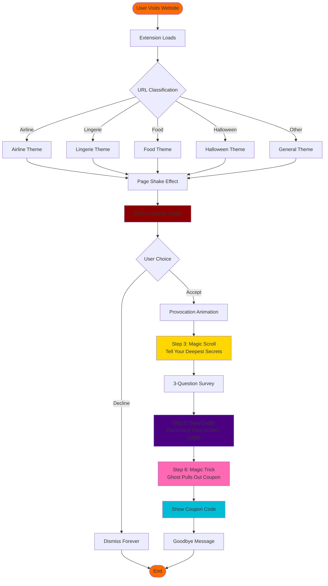
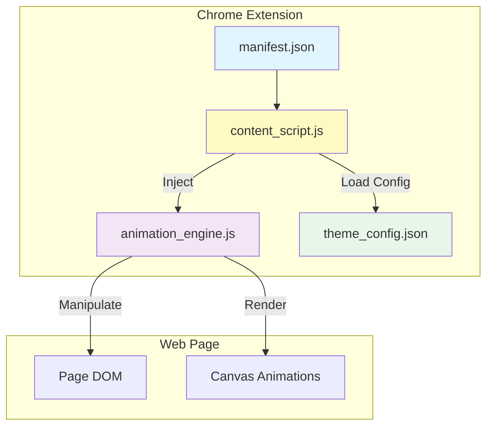
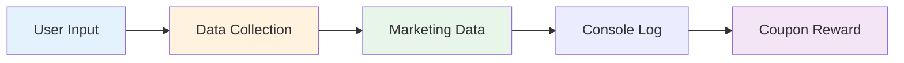

# Kiroween System Flow

## Main User Journey

## System Architecture

## Data Flow

---

## Tech Stack

- **Chrome Extension API** - Extension framework
- **Canvas API** - Animation rendering
- **JavaScript ES6+** - Core logic
- **CSS3** - Styling and transitions
- **JSON** - Configuration management

## Key Features

1. **Smart URL Classification** - Auto-select theme based on website type
2. **Storytelling Animations** - Three key narrative moments (Magic Scroll, Data Castle, Magic Trick)
3. **Data Collection** - User behavior and preference analysis
4. **Coupon Reward** - Incentive mechanism after interaction
5. **Responsive Design** - Adapts to different screen sizes
